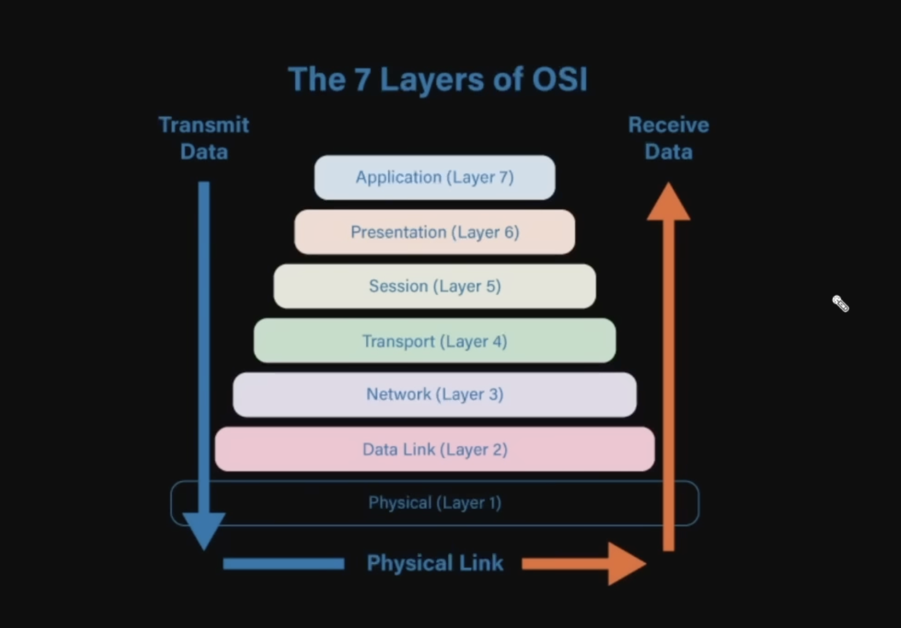
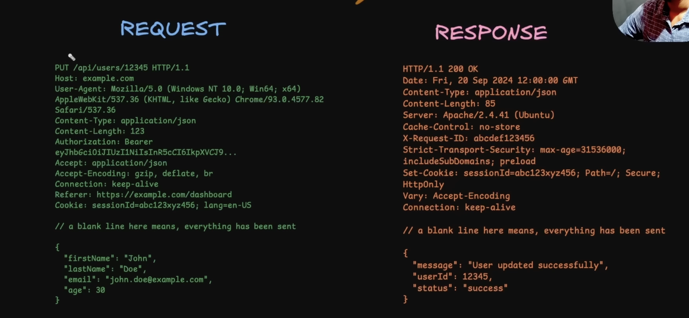
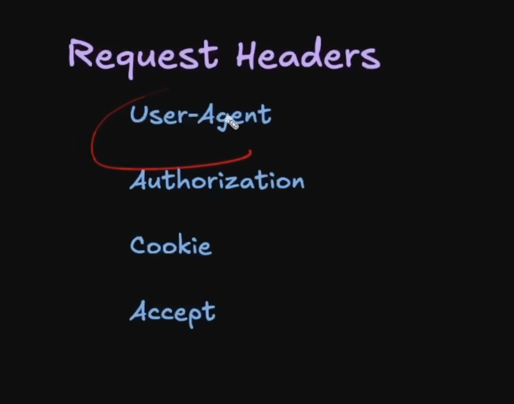
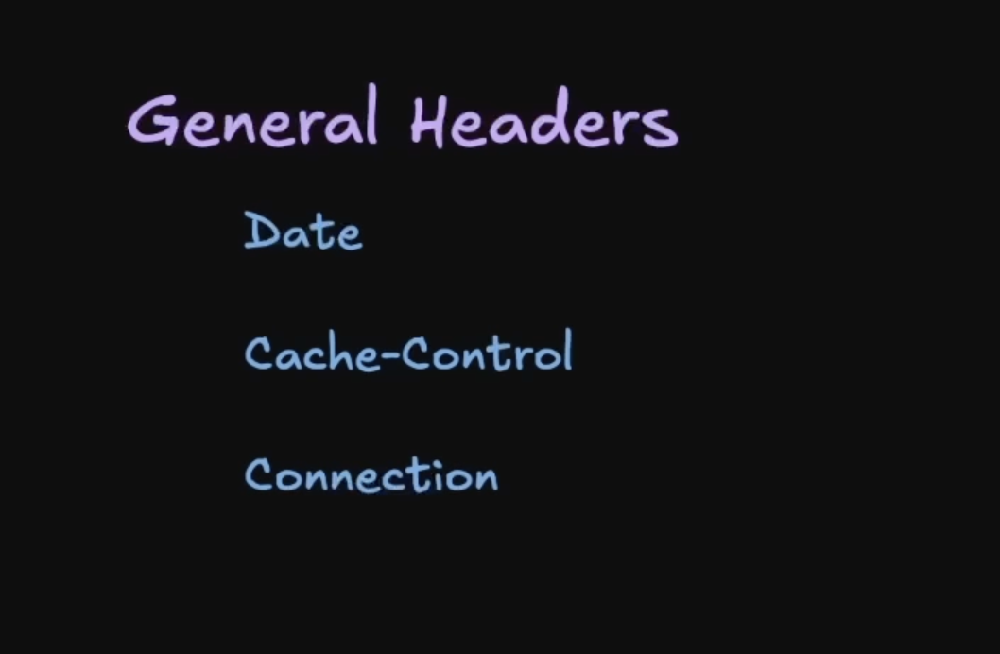
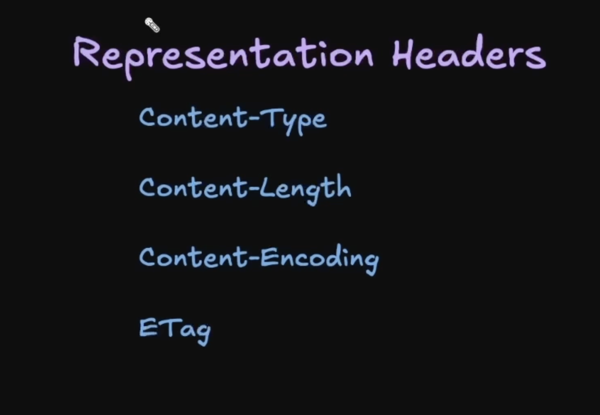
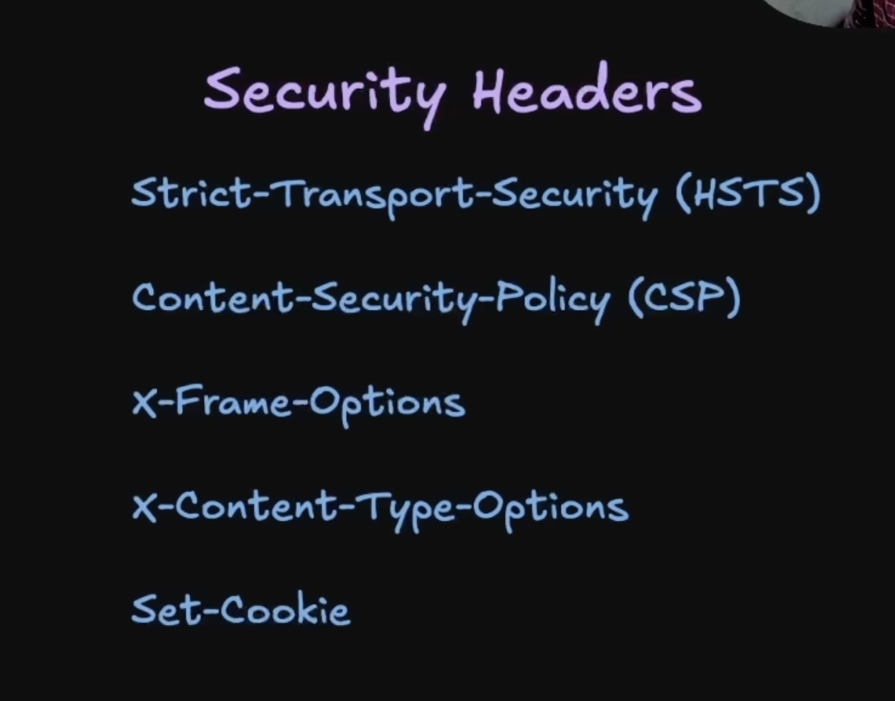
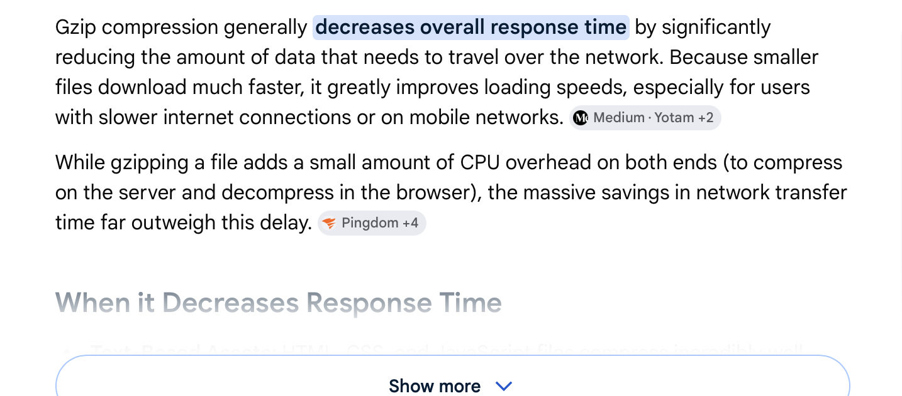

# Lecture 5: The HTTP Protocol – The Medium of the Web

## Introduction
HTTP (Hypertext Transfer Protocol) is the foundational protocol of the World Wide Web. It serves as the primary medium through which browsers (clients) and servers communicate. In backend engineering, understanding HTTP from "First Principles" is essential, as 90% of modern codebases rely on this protocol for data exchange.

---

## 1. Core Principles: The Heart of HTTP

### A. Statelessness
HTTP is a **stateless** protocol, meaning it has **no memory of past interactions**. 
- **The Concept:** Each request is independent. If a client makes two consecutive requests, the server treats the second one as a completely new and unrelated event.
- **Self-Contained Requests:** Since the server forgets the client immediately after responding, every request must carry all necessary information, such as headers, URLs, and authentication tokens (e.g., Cookies or JWT).
- **Benefits:**
    - **Simplicity:** Simplifies server architecture because the server doesn't need to track session state in memory.
    - **Scalability:** Requests can be distributed across multiple servers without worrying about which server "knows" the user.
    - **Resilience:** If a server crashes, it doesn't lose client interaction state because there was none to begin with.

### B. Client-Server Model
HTTP operates on a strict request-response flow initiated by the client.
- **Initiation:** Communication is always started by the client (browser, mobile app, etc.) to get a response from the server.
- **Roles:** The client is responsible for providing all context (URL, headers); the server hosts the resources (APIs, web pages) and waits for incoming requests.

---

## 2. The Transport Layer: Reliability & Security

### A. The Requirement for Reliability (TCP)
While HTTP lives at the **Application Layer (OSI Layer 7)**, it requires an underlying protocol that is **reliable** and does not lose messages. 
- **TCP (Transmission Control Protocol):** HTTP relies on TCP because it is connection-oriented.
- **The 3-Way Handshake:** Before data is sent, TCP establishes a connection via a three-step process: `SYN` (Synchronize), `SYN-ACK` (Synchronize-Acknowledge), and `ACK` (Acknowledge).

### B. SSL, TLS, and HTTPS
We often use HTTP and HTTPS interchangeably, but the difference lies in the security layer.
- **SSL (Secure Sockets Layer):** The original protocol for securing communications. It encrypts data (passwords, credit cards) to prevent interception. **Note:** SSL is now outdated due to vulnerabilities.
- **TLS (Transport Layer Security):** The modern, secure successor to SSL. It uses certificates to authenticate the server and establishes an encrypted tunnel for data transit.
- **HTTPS (HTTP Secure):** This is simply **HTTP over TLS**. When you visit an HTTPS site, the underlying TLS protocol encrypts the entire communication.
- **Handshake Evolution:** 
    - **TLS 1.2:** Requires 2 round-trips (2-RTT) for the security handshake.
    - **TLS 1.3:** The current standard; it streamlines the process to 1 round-trip (1-RTT) and supports **0-RTT** (resumption), allowing data to be sent immediately if the client has connected before.

---

## 3. Evolution of HTTP Versions

| Version | Transport | Format | Key Improvement |
| :--- | :--- | :--- | :--- |
| **HTTP/1.0** | TCP | Text | Each request opens/closes a new connection (Inefficient). |
| **HTTP/1.1** | TCP | Text | **Persistent Connections** (Keep-Alive); multiple requests over one connection. |
| **HTTP/2.0** | TCP | **Binary** | **Multiplexing**; multiple requests simultaneously; Header Compression (HPACK). |
| **HTTP/3.0** | **QUIC (UDP)** | Binary | Built on QUIC; solves **Head-of-Line (HOL) Blocking**; faster handshakes. |

---

## 4. Anatomy of HTTP Messages

### The "Parcel" Analogy for Headers
Think of an HTTP request as a physical parcel.
- **The Payload (Body):** The actual item inside the box (e.g., a JSON object or image).
- **The Headers:** The metadata written *on top* of the box (Recipient address, phone number, state). 
- **Why Headers?** Transmitters (proxies, load balancers, servers) need to see this metadata without "opening the box" (parsing the body) to decide how to route or handle the message.

### Request vs. Response
- **Request:** Includes the **Method** (GET/POST), **URL**, **Version**, and **Headers**.
- **Response:** Includes the **Status Code** (200/404), **Headers**, and the **Body** (the requested content).

---

## 5. HTTP Methods: Defining Intent
Methods give semantic meaning to an action.

| Method | Safe? | Idempotent? | Description |
| :--- | :---: | :---: | :--- |
| **GET** | ✅ | ✅ | Fetch data. Should not modify server state. |
| **POST** | ❌ | ❌ | Create data. Multiple posts = Multiple resources created. |
| **PUT** | ❌ | ✅ | Complete replacement of a resource. |
| **PATCH** | ❌ | ❌ | Partial update/append to a resource. |
| **DELETE** | ❌ | ✅ | Remove a resource. Once deleted, it stays deleted. |

**Idempotency:** A method is idempotent if calling it multiple times has the same intended effect as calling it once. (e.g., Deleting a file twice still results in the file being gone).

---

## 6. Detailed Header Categorization
Headers are key-value pairs that act as the metadata for the interaction. They can be broadly categorized:

- **Request Headers:** Sent by the client to provide context (e.g., `User-Agent`, `Authorization`, `Accept`).

- **General Headers:** Apply to both requests and responses (e.g., `Date`, `Cache-Control`, `Connection`).

- **Representation Headers:** Describe the format and encoding of the message body (e.g., `Content-Type`, `Content-Length`, `Content-Encoding`, `ETag`).

- **Security Headers:** Enhance security by controlling browser behavior (e.g., `Strict-Transport-Security`, `Content-Security-Policy`, `X-Frame-Options`).

---

## 7. CORS: The Browser's Security Guard
**CORS (Cross-Origin Resource Sharing)** is a security mechanism enforced by browsers (not servers) to manage the **Same Origin Policy**.

### Pre-flight Request (OPTIONS)
For "complex" requests (like those with custom headers or JSON bodies), the browser sends an **OPTIONS** request *before* the actual request.
- **The Inquiry:** "Do you allow a PUT request from `example.com`?"
- **The Response:** The server responds with headers like `Access-Control-Allow-Origin`. If approved, the browser fires the original request.

---

## 8. HTTP Response Status Codes
Standardized language for server results:
- **1xx (Informational):** Switching protocols (e.g., 101 for WebSockets).
- **2xx (Success):** `200 OK` (Standard success), `201 Created` (POST success), `204 No Content` (Successful, but no body returned).
- **3xx (Redirection):** `301 Moved Permanently`, `304 Not Modified` (Use the cached version).
- **4xx (Client Error):** `400 Bad Request` (Invalid data), `401 Unauthorized` (Login required), `403 Forbidden` (No permission), `404 Not Found`, `429 Too Many Requests` (Rate limiting).
- **5xx (Server Error):** `500 Internal Error`, `502 Bad Gateway` (Upstream server failure), `504 Gateway Timeout`.

---

## 9. Performance Optimizations

### A. HTTP Caching
- **ETag:** A hash of the resource. If the resource hasn't changed, the server returns `304 Not Modified`, saving bandwidth.
- **Cache-Control:** Headers that tell the browser how long to keep a copy of the resource.

### B. Content Negotiation
Allows the client and server to agree on the best format:
- `Accept`: Prefers JSON or XML.
- `Accept-Language`: Prefers English or Spanish.
- `Accept-Encoding`: Supports compression like **Gzip** (which can reduce file sizes by up to 90%).

### C. Large Data Handling
- **Multipart Requests:** Splits large files into binary parts separated by a **boundary** string.
- **Chunked Transfer/SSE:** Streams data to the client in small chunks over a single connection, useful for real-time logs or large text files.

---

## Keywords
Statelessness, TCP Handshake, SSL/TLS, HTTPS, Multiplexing, Binary Framing, QUIC, Idempotency, CORS, Pre-flight, Status Codes, ETag, Content Negotiation, Gzip, Multipart, Chunked Transfer.

