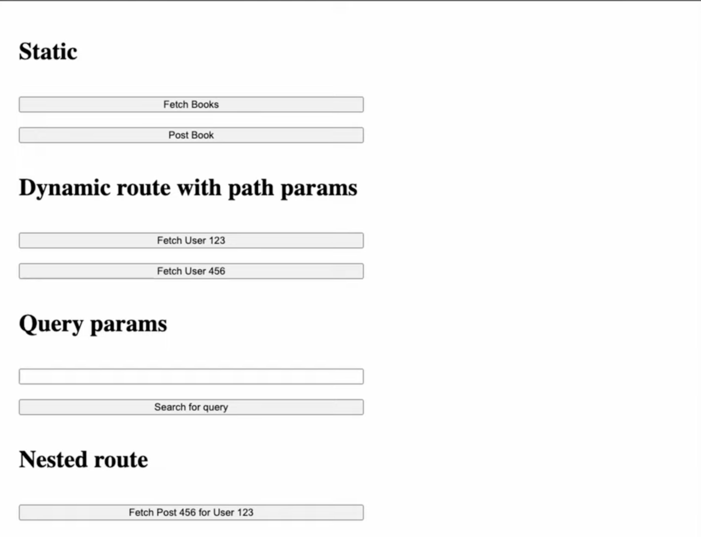
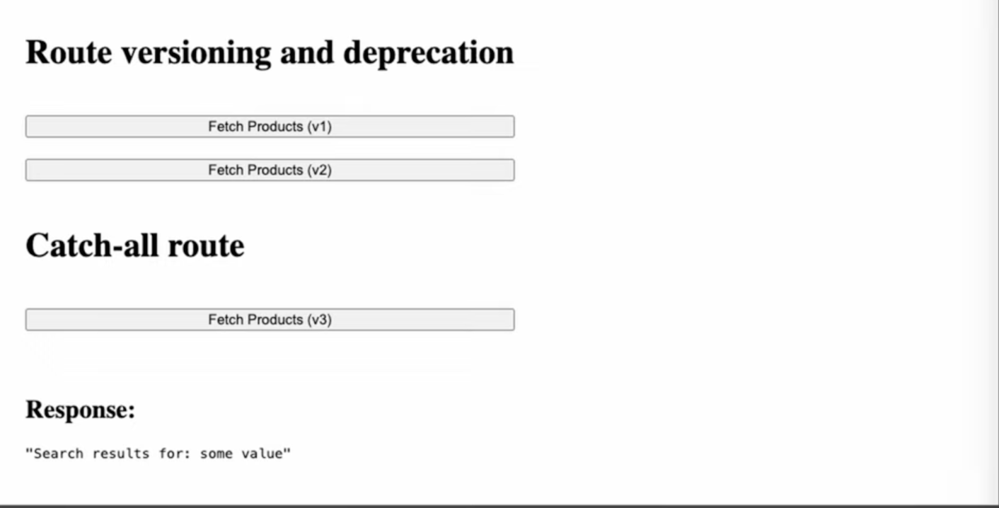

# Lecture 6: Routing – How Requests Find Their Way Home

## Introduction
In the previous lecture, we explored HTTP methods as the "What" of a request—they express the **intent**. Routing completes the interaction by expressing the **"Where"**. It is the mechanism that maps a specific URL and HTTP method to a dedicated set of instructions on the server, known as a **Handler**.

---

## 1. Core Principles: The Anatomy of a Route

### A. The "What" vs. The "Where"
A server uses two primary signals to decide which code to execute:
1.  **The Method (Intent):** "I want to FETCH data" (GET) or "I want to CREATE data" (POST).
2.  **The Route (Destination):** "In the `users` collection" or "In the `books` catalog".

**First Principle:** The combination of **Method + Path** acts as a unique key in the server's routing table. This ensures that a `GET /books` and a `POST /books` can exist at the same address without ever clashing, as they trigger different business logic.

### B. Route Mapping (The Handler)
Routing is essentially a lookup table.
- **Request:** Incoming `GET /api/users`
- **Lookup:** Server finds a matching pattern in its code.
- **Action:** Executes the `getUsers()` function and returns the response.

---

## 2. Types of Routes

### A. Static Routes
Static routes are constant strings that never change. They point to a fixed resource or action.
- **Example:** `GET /api/books` or `POST /api/login`.
- **Characteristic:** No part of the URL string is variable.

### B. Dynamic Routes (Path Parameters)
Dynamic routes allow you to embed variables directly into the URL path. This is essential for identifying unique resources.
- **Syntax:** Often denoted by a colon (e.g., `/api/users/:id`).
- **Example:** `/api/users/123` tells the server to fetch the user with ID `123`.
- **Terminology:** These variable segments are called **Path Parameters** or **Route Parameters**.

---

## 3. Query Parameters: The GET Request's Payload

### A. Definition
Since standard **GET** requests do not have a body, we use **Query Parameters** to send metadata to the server.
- **Structure:** Appended after a `?` in the URL.
- **Format:** Key-value pairs (e.g., `?query=sum+value&sort=desc`).

### B. Common Applications
Query parameters are the industry standard for:
1.  **Filtering:** `/products?category=electronics`
2.  **Sorting:** `/users?order=alphabetical`
3.  **Search:** `/search?q=backend+basics`
4.  **Pagination:** `/books?page=2&limit=20`

---

## 4. Advanced Routing Patterns

### A. Nested Routes (Resource Hierarchy)
In REST APIs, nesting is used to express relationships between resources semantically.
- **Scenario:** You want a specific post belonging to a specific user.
- **Route:** `/api/users/:userId/posts/:postId`
- **Semantic Meaning:** "Go to the **users**, find user **123**, go to their **posts**, and find post **456**."

### B. Route Versioning
Versioning prevents **Breaking Changes**. If you update the format of your JSON response, you shouldn't break the existing mobile app or website.
- **Practice:** Prefix routes with a version number (e.g., `/v1/products` vs `/v2/products`).
- **Deprecation Workflow:**
    1.  Release **V2** with the new structure.
    2.  Keep **V1** running for a "migration window".
    3.  Notify clients to switch.
    4.  Eventually shut down **V1**.

### C. Catch-All Routes (The Safety Net)
A "Catch-all" route is a wildcard handler placed at the very end of the routing logic.
- **Symbol:** Often `*` or `/*`.
- **Purpose:** If a request doesn't match any defined Static, Dynamic, or Nested route, it "falls through" to the catch-all.
- **UX Benefit:** Instead of a generic server crash or null response, the server returns a user-friendly **404 Not Found** message.

---

## 5. Summary Table: Parameters Comparison

| Feature | Path Parameter | Query Parameter |
| :--- | :--- | :--- |
| **Location** | Part of the URL path (`/users/123`) | After the `?` (`?id=123`) |
| **Semantics** | Identifies a **Resource** | Identifies **Metadata/Filters** |
| **Mandatory** | Usually required for the route to match | Usually optional |
| **Readability** | High (Human readable) | Lower (Technical pairs) |

---

## Keywords
Routing, Handler, Static Route, Dynamic Route, Path Parameters, Query Parameters, Pagination, Nested Routing, Versioning, Deprecation, Catch-all Route, 404 Not Found.
